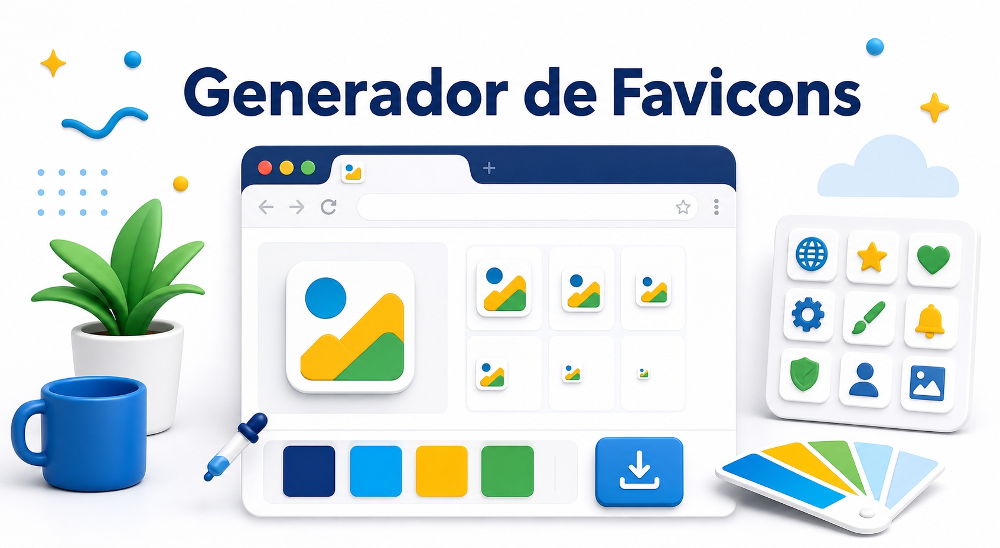

<p align="center">
  
</p>

# Generador de Favicons Aquidauana

Proyecto simple para generar favicons en SVG y PNG con elementos inspirados en la identidad visual de Aquidauana.

Este proyecto usa HTML, CSS y JavaScript puro. Los archivos están separados con una idea básica de MVC para facilitar el estudio.

## Idiomas

- [Português](README.md)
- [English](README.en.md)
- [Español](README.es.md)

## Estructura

```text
.
|-- assets/
|   `-- readme/
|       |-- banner-pt.png
|       |-- banner-en.png
|       `-- banner-es.png
|-- index.html
|-- src/
|   |-- css/
|   |   `-- style.css
|   |-- data/
|   |   `-- access.json
|   `-- js/
|       |-- model.js
|       |-- view.js
|       |-- controller.js
|       `-- counter.js
|-- README.md
|-- README.en.md
|-- README.es.md
|-- CONTRIBUTING.md
`-- LICENSE
```

## Cómo abrir

Abre el archivo `index.html` en el navegador.

No es necesario instalar dependencias, ejecutar build o configurar servidor.

## Cómo se usa MVC

- `model.js`: guarda colores, nombres de íconos y SVGs.
- `view.js`: actualiza la pantalla, muestra mensajes y hace las descargas.
- `controller.js`: recibe los clics y conecta el Model con la View.
- `counter.js`: cuenta accesos en el navegador con `localStorage`.
- `access.json`: guarda la configuración inicial del contador.
- `index.html`: contiene la estructura de la página.
- `style.css`: contiene los estilos del proyecto.

## Recursos

- Selección de íconos.
- Fondo transparente, cuadrado o circular.
- Selección del color de fondo.
- Vista previa del favicon.
- Descarga en SVG.
- Descarga en PNG 32, 180 y 512.
- Código HTML básico para usar el favicon.
- Contador local de accesos.

## Contador de accesos

El contador usa `src/data/access.json` como configuración inicial y guarda las visitas en el `localStorage` del navegador en formato JSON.

Como el proyecto está hecho en HTML puro, no puede guardar datos en un JSON en el servidor. Por eso, el contador muestra los accesos de ese navegador. Para contar accesos reales de todos los visitantes, sería necesario usar una API, servicio externo o función serverless.

## Licencia

Uso gratuito. Este proyecto está licenciado bajo la licencia MIT.
