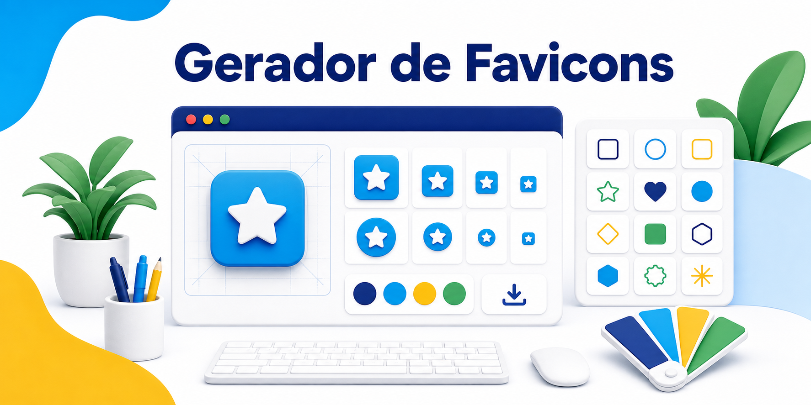

<p align="center">
  
</p>

# Gerador de Favicons Aquidauana

Projeto simples para gerar favicons em SVG e PNG com elementos inspirados na identidade visual de Aquidauana.

Este projeto foi organizado de forma básica, usando HTML, CSS e JavaScript puro. A separação segue uma ideia simples de MVC para facilitar o estudo.

## Idiomas

- [Português](README.md)
- [English](README.en.md)
- [Español](README.es.md)

## Estrutura

```text
.
|-- assets/
|   `-- readme/
|       |-- banner-pt.png
|       |-- banner-en.png
|       `-- banner-es.png
|-- .gitignore
|-- favicon.svg
|-- index.html
|-- src/
|   |-- css/
|   |   `-- style.css
|   `-- js/
|       |-- model.js
|       |-- view.js
|       |-- controller.js
|       `-- counter.js
|-- README.md
|-- README.en.md
|-- README.es.md
|-- CONTRIBUTING.md
`-- LICENSE
```

## Como abrir

Abra o arquivo `index.html` no navegador.

Não precisa instalar dependências, rodar build ou configurar servidor.

## Como o MVC foi usado

- `model.js`: guarda as cores, os nomes dos ícones e os SVGs.
- `view.js`: atualiza a tela, mostra avisos e faz os downloads.
- `controller.js`: recebe os cliques e liga o Model com a View.
- `counter.js`: conta acessos no navegador usando `localStorage`.
- `access.json`: arquivo local ignorado pelo Git para não sobrescrever views do servidor.
- `index.html`: contém a estrutura da página.
- `style.css`: contém o visual do projeto.

## Recursos

- Escolha de ícones.
- Fundo transparente, quadrado ou circular.
- Escolha da cor do fundo.
- Prévia do favicon.
- Download em SVG.
- Download em PNG 32, 180 e 512.
- Código HTML básico para uso do favicon.
- Contador local de acessos.

## Contador de acessos

O contador tenta usar `src/data/access.json` como configuração local e salva as visitas no `localStorage` do navegador em formato JSON.

O arquivo `src/data/access.json` fica no `.gitignore` para evitar sobrescrever as views atuais do servidor.

Como o projeto é feito em HTML puro, ele não grava dados em um JSON no servidor. Por isso, o contador mostra os acessos daquele navegador. Para contar acessos reais de todos os visitantes, seria necessário usar uma API, serviço externo ou função serverless.

## Licença

Uso gratuito. Este projeto está licenciado pela licença MIT.
